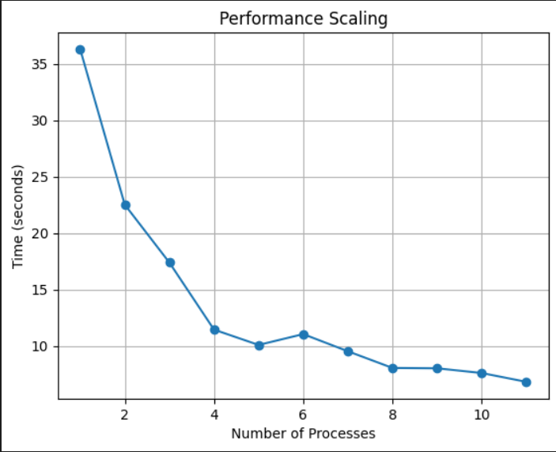
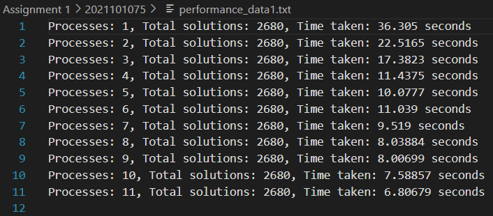

#                                                           ASSIGNMENT 1 

## Question 1

###  Total Time Complexity

The time complexity of the N-Queens problem is usually expressed as O(n!), where n is the number of queens (and the size of the chessboard). In this MPI implementation, each process computes a subset of permutations independently, distributing the time complexity across the processes. The overall time complexity remains O(n!) but divided among the processes. Considering each process as performing an equal share of the work, the time complexity per process is O(n! / P), where P is the number of processes.

### Total Message Complexity

Message complexity refers to the number of messages exchanged between processes. In this implementation, main communication occurs during the MPI_Bcast and MPI_Reduce operations. MPI_Bcast sends the value of 'n' to all processes, and MPI_Reduce gathers subtotals from each process to calculate the total. Message complexity is proportional to the number of processes, making it O(P).

### Space Requirements

Space complexity is determined by the memory used by each process. Primary data structures are vectors ('perm', 'pre_fact') and scalar variables. Space complexity per process is O(n) for vectors and O(1) for other variables.

### Performance Scaling

The MPI implementation of the N-Queens problem demonstrates effective parallel scalability. There is a noticeable speedup when transitioning from one to two processes. However, diminishing returns set in as the process count increases, indicating an optimal range of parallelization, notably around 8 processes. The total solutions remain constant at 2680, affirming the correctness of the parallelized solution. Diminishing returns are attributed to increasing communication overhead between processes.

Question 2 :
time complexity : O(N3/P)
broadcasr message : O(N2)
spcace complexituy :O(n2)
<!-- long long krke graoh bananlena -->

Question 3:
time complexity : o(nmt/p)
message complexity:o(n2)
space complexity : o(n2)
