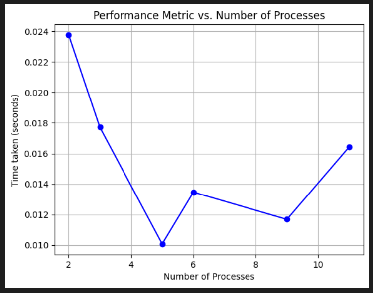
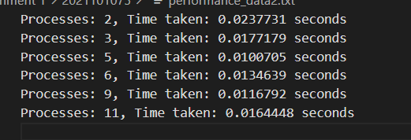

#                                                           ASSIGNMENT 1 

## Question 1

###  Total Time Complexity

The time complexity of the N-Queens problem is usually expressed as O(n!), where n is the number of queens (and the size of the chessboard). In this MPI implementation, each process computes a subset of permutations independently, distributing the time complexity across the processes. The overall time complexity remains O(n!) but divided among the processes. Considering each process as performing an equal share of the work, the time complexity per process is O(n! / P), where P is the number of processes.

### Total Message Complexity

Message complexity refers to the number of messages exchanged between processes. In this implementation, main communication occurs during the MPI_Bcast and MPI_Reduce operations. MPI_Bcast sends the value of 'n' to all processes, and MPI_Reduce gathers subtotals from each process to calculate the total. Message complexity is proportional to the number of processes, making it O(P).

### Space Requirements

Space complexity is determined by the memory used by each process. Primary data structures are vectors ('perm', 'pre_fact') and scalar variables. Space complexity per process is O(n) for vectors and O(1) for other variables.

### Performance Scaling

The MPI implementation of the N-Queens problem demonstrates effective parallel scalability. There is a noticeable speedup when transitioning from one to two processes. However, diminishing returns set in as the process count increases, indicating an optimal range of parallelization, notably around 8 processes. The total solutions remain constant at 2680, affirming the correctness of the parallelized solution. Diminishing returns are attributed to increasing communication overhead between processes.

# MPI Parallel Implementation of Floyd-Warshall Algorithm

## 1. Total Time Complexity
   - The Floyd-Warshall algorithm has a time complexity of O(N^3), where N is the number of vertices (nodes) in the graph.
   - In this MPI implementation, the algorithm is parallelized by distributing rows of the adjacency matrix across different processes.
   - The time complexity per process would be O(N^3 / P), where P is the number of processes.
   - The sequential part of the algorithm (when size is 1) is still O(N^3).

## 2. Total Message Complexity
   - The primary communication operations are MPI_Bcast and MPI_Send/MPI_Recv.
   - MPI_Bcast is used to broadcast the matrix dimensions and data to all processes, which has a message complexity of O(N*2).
   - Message complexity is influenced by the number of processes and the data exchanged. In this case, it's proportional to the size of the adjacency matrix.

## 3. Space Requirements
   - The space complexity is determined by the memory used by each process.
   - The primary data structures are vectors ('adjacencyMatrix', 'localMatrix', 'kth') and scalar variables.
   - The space complexity per process is O(N^2), dominated by the adjacency matrix.

## 4. Performance Scaling (1 to 12 processes)
- The MPI parallel Floyd-Warshall algorithm initially demonstrates improved performance as the number of processes increases for an input size larger than 100 vertices. However, beyond a certain point, communication overhead becomes a limiting factor, leading to fluctuations in execution time. 
  
  

Question 3:
time complexity : o(nmt/p)
message complexity:o(n2)
space complexity : o(n2)
